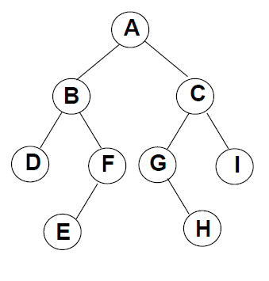
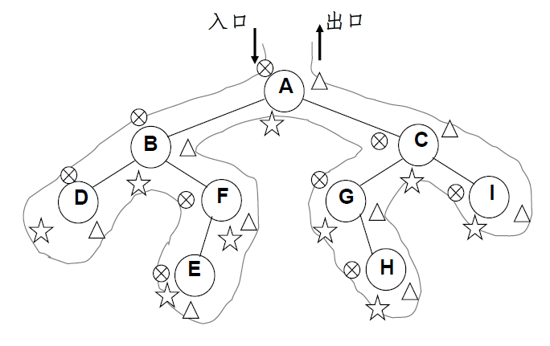

#### 1.  树的定义

树（Tree）: n（n≥0）个结点构成的有限集合。
	当n=0时，称为空树；
	对于任一棵非空树（n> 0），它具备以下性质：
树中有一个称为“根（Root）”的特殊结点，用 r 表示；
其余结点可分为m(m>0)个互不相交的有限集T1，T2，... ，Tm，其中每个集合本身又是一棵树，称为原来树		的“子树（SubTree）”

 子树是不相交的；
 除了根结点外，每个结点有且仅有一个父结点；
 一棵N个结点的树有N-1条边。

#### 2. 树的一些基本术语

1.结点的度（Degree）：结点的子树个数
2.树的度：树的所有结点中最大的度数
3.叶结点（Leaf）：度为0的结点
4.父结点（Parent）：有子树的结点是其子树的根结点的父结点
5.子结点（Child）：若A结点是B结点的父结点，则称B结点是A结点的子结点；子结点也称孩子结点。
6.兄弟结点（Sibling）：具有同一父结点的各结点彼此是兄弟结点。
7.路径和路径长度：从结点n1到nk的路径为一个结点序列n1 , n2 ,… , nk , ni是 ni+1的父结点。路径所包含边的个数为路径的长度。
8.祖先结点(Ancestor)：沿树根到某一结点路径上的所有结点都是这个结点的祖先结点。 
9.子孙结点(Descendant)：某一结点的子树中的所有结点是这个结点的子孙。 
10.结点的层次（Level）：规定根结点在1层，其它任一结点的层数是其父结点的层数加1。 
11.树的深度（Depth）：树中所有结点中的最大层次是这棵树的深度。

#### 3. 二叉树的定义

二叉树T：一个有穷的结点集合。
	这个集合可以为空
	若不为空，则它是由根结点和称为其左子树TL和右子树TR的两个不相交的二叉树组成。

​	完全二叉树(Complete Binary Tree) 有n个结点的二叉树，对树中结点按从上至下、从左到右顺序进行编号，编号为i（1 ≤ i ≤ n）结点与满二叉树中编号为 i 结点在二叉树中位置相同

#### 4. 二叉树的遍历														
(1) 先序遍历	
遍历过程为：                                   A（B D F E ）（C G H I）
                                                  先序遍历=> A B D F E C G H I
①访问根结点；
②先序遍历其左子树；
③先序遍历其右子树。

 

(2) 中序遍历

遍历过程为：							（D B E F） A （G H C I）
												中序遍历=> D B E F A G H C I
①中序遍历其左子树；
②访问根结点；
③中序遍历其右子树。

(2) 后序遍历

遍历过程为：								（D E F B ）（ H G I C） A
												后序遍历=> D E F B H G I C A
①后序遍历其左子树；
②后序遍历其右子树；
③访问根结点。

 先序、中序和后序遍历过程：遍历过程中经过结点的路线一样，只是访问各结点的时机不同。
 图中在从入口到出口的曲线上用✖☆和△三种符号分别标记出了先序、中序和后序访问各结点的时刻

 

#### 5. 二叉树的非递归遍历

中序遍历非递归遍历算法
非递归算法实现的基本思路：使用堆栈

中序遍历非递归遍历算法
 遇到一个结点，就把它压栈，并去遍历它的左子树；
 当左子树遍历结束后，从栈顶弹出这个结点并访问它；
 然后按其右指针再去中序遍历该结点的右子树。
#### 6.层序遍历

二叉树遍历的核心问题：二维结构的线性化
从结点访问其左、右儿子结点
访问左儿子后，右儿子结点怎么办？
需要一个存储结构保存暂时不访问的结点
存储结构：堆栈、队列

队列实现：遍历从根结点开始，首先将根结点入队，然后开始执行循环：结点出队、访问该结点、其左右儿子入队

层序基本过程：先根结点入队，然后：
 从队列中取出一个元素； 
 访问该元素所指结点；
若该元素所指结点的左、右孩子结点非空， 则将其左、右孩子的指针顺序入队。

#### **7.二叉搜索树**

（BST，Binary Search Tree），也称二叉排序树或二叉查找树

二叉搜索树：一棵二叉树，可以为空；如果不为空，满足以下性质：

1. **非空左子树**的所有键值**小于**其根结点的键值。
2. **非空右子树**的所有键值**大于**其根结点的键值。
3. 左、右子树都是**二叉搜索树**。

